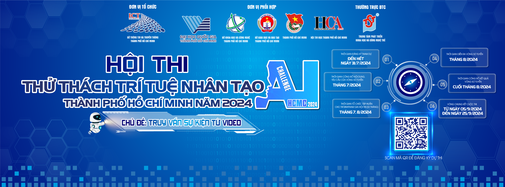

  

<h1 align="center">HCMC-AIC2024</h1>

  <em>Joining forces with innovators and AI enthusiasts, this project is a dynamic collaboration aimed at crafting a cutting-edge event-retrieval system, proudly participating in the Ho Chi Minh AI Challenge 2024.</em>

<!-- TABLE OF CONTENTS -->

  
Table of Contents

- [📍 Overview](#-overview)
- [🎯 Features](#-features)
- [🤖Tech Stack](#-technologies-used)
- [🚀 Usage](#-getting-started)
- [👣 Workflow](#-workflow)
- [👀 Demo](#-demo)
- [🧑‍💻 Contributors](#-Contributors)

## 📍 Overview
Welcome! This project is a collaborative endeavor to develop an advanced event-retrieval system. As a participant in the esteemed Ho Chi Minh AI Challenge 2024, our team, **AIO_TOP10**, is dedicated to harnessing the power of artificial intelligence to create a robust and efficient event-retrieval solution.

More details about the challenge refers to this [link.](https://aichallenge.hochiminhcity.gov.vn/)

## 🎯 Features

- 

## 🤖 Tech Stack

### Server building

- Back-end: FastAPI. 
- Front-end: FastAPI (Jinja2), HTML/CSS/JS, Boostrap. 
- Container: Docker.

### Core technology

- Keyframe-extraction: TransNetV2, K-Means. 
- LLM: Gemini, Groq, SambaNova, etc. 
- Embedding: CLIP. 

## 🚀 Usage

**Clone the repository**

**Setup Environment**

The project utilizes LLMs for prompt refinement, therefore, you have to get API's keys from Gemini or Groq to achieve the best result. In order to integrate to the system, move to the `/backend` directory and create an `.env` file. The `.env.example` demonstrates to content of the `.env` file. 

**Run the application**

**API Inference**

## 👣 Workflow

## 👀 Demo

## 🧑‍💻 Contributors

